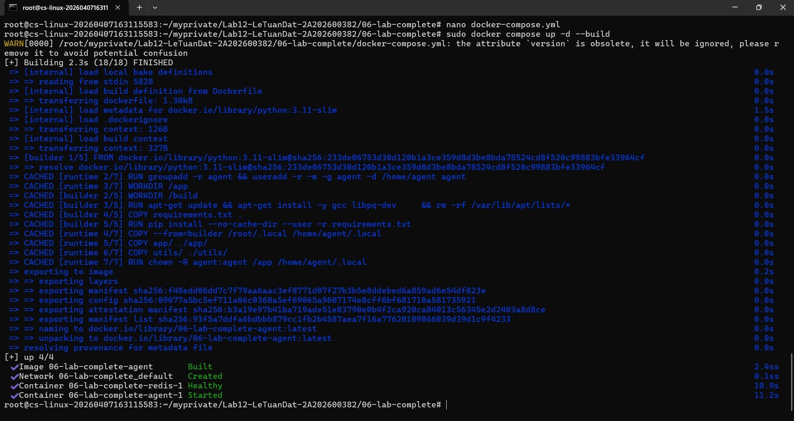
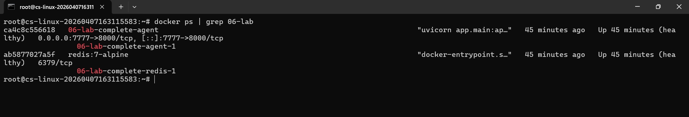
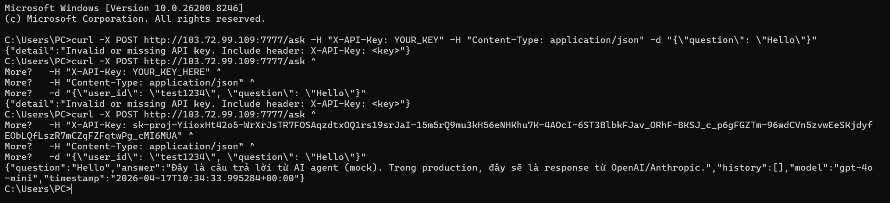

# Deployment Information

## Public URL
http://103.72.99.109:7777/

## Platform
Self-hosted VPS

## Test Commands

### Health Check
```bash
curl http://103.72.99.109:7777/health
{
  "status": "ok",
  "version": "1.0.0",
  "environment": "staging",
  "uptime_seconds": 2149.7,
  "total_requests": 55,
  "checks": {
    "llm": "mock"
  },
  "timestamp": "2026-04-17T10:21:07.752306+00:00"
}
```

### API Test (with authentication)
```bash
curl -X POST http://103.72.99.109:7777/ask \
  -H "X-API-Key: YOUR_KEY" \
  -H "Content-Type: application/json" \
  -d '{"user_id": "test", "question": "Hello"}'
```

## Environment Variables Set
- `PORT`
- `REDIS_URL`
- `AGENT_API_KEY`
- `OPENAI_API_KEY` (optional)
- `ENVIRONMENT=production`
- `RATE_LIMIT_PER_MINUTE=20`
- `DAILY_BUDGET_USD=5.0`

## Screenshots
- 
- 
- 
